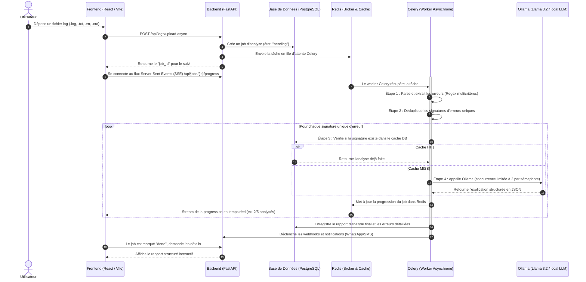

# Rapport final - Log Analyzer AI

## 1. Présentation Générale & Objectif

**Log Analyzer AI** est une solution moderne et robuste d'analyse de fichiers de logs assistée par Intelligence Artificielle locale. L'application résout un problème clé pour les équipes de développement et de support d'exploitation : **l'identification et la résolution rapides d'incidents**.

En s'appuyant sur des modèles de langage légers et locaux (Llama 3.2), elle extrait les erreurs des journaux d'événements, catégorise les anomalies et génère des guides de résolution structurés contenant :
- Une **explication** simple du dysfonctionnement.
- Les **causes probables** techniques sous-jacentes.
- Des **solutions concrètes** et étapes recommandées pour le débogage.

---

## 2. Synthèse Globale du Fonctionnement

Voici le cycle complet suivi par l'application pour traiter et analyser un fichier de logs :



---

## 3. Architecture Détaillée et Choix Techniques

Le système est structuré sous forme de microservices orchestrés par Docker Compose :

### 3.1. Le Frontend (React + Vite + Nginx)
- **Rôle** : Interface utilisateur réactive et intuitive.
- **Détails de conception** :
  - **Refactorisation** : La logique globale de l'interface et de navigation a été restructurée en découpant le fichier principal `App.jsx` en sous-composants réutilisables, notamment `Navbar.jsx` (gestion globale de l'affichage, thèmes, langues et notifications) et `AccountModals.jsx` (modals d'informations de profil et réglages).
  - **Techno** : Single Page Application propulsée par Vite pour des builds ultra-rapides et servie par un conteneur Nginx léger faisant office de reverse proxy pour masquer les ports API.
  - **Aesthetics & UX** : Interface moderne supportant nativement le Mode Sombre/Clair, la gestion bilingue (i18n), des graphes interactifs (Dashboard d'activité et de répartition des anomalies) et des raccourcis clavier pour naviguer à la vitesse d'un sysadmin.

### 3.2. Le Backend (FastAPI)
- **Rôle** : API Gateway, contrôle d'accès, gestion du multitenancy et distribution des tâches.
- **Fonctionnalités avancées intégrées** :
  - **Authentification & RBAC** : Sécurisé par jetons JWT asynchrones avec gestion des rôles (Admin, Analyst, Viewer) et isolation des données par locataire (Multi-tenant).
  - **Rate Limiting** : Protection brute-force distribuée basée sur une fenêtre glissante stockée dans Redis (avec un fallback automatique en mémoire vive en cas de panne de Redis).
  - **SSE (Server-Sent Events)** : Notification push au client web de la progression des jobs asynchrones.

### 3.3. Gestion Asynchrone (Celery + Redis)
- **Rôle** : Traitement lourd en arrière-plan.
- **Pourquoi ce choix ?** L'analyse par modèle de langage local prend en moyenne de 1.5s à 4s par ligne d'erreur. Bloquer la requête HTTP FastAPI mènerait à des timeouts clients.
- **Calibrage de Concurrence** : Le sémaphore de parallélisation a été finement configuré à `2` dans `worker.py` pour s'aligner sur les limitations physiques courantes de GPU grand public (comme une GTX 1650 Ti à 4 Go fonctionnant sous `OLLAMA_NUM_PARALLEL=1`), évitant toute saturation de la VRAM.

### 3.4. Cache & Persistance (PostgreSQL + Alembic)
- **Rôle** : Stockage persistant et historique.
- **Cycle de Vie & Évolution** : Toutes les évolutions de schémas (comme l'ajout des colonnes `status` et `created_at` sur la table `users`) sont rigoureusement orchestrées via des scripts de migration Alembic. L'initialisation automatique via code applicatif n'effectue plus d'instructions `ALTER TABLE` invasives en production, garantissant l'intégrité de la structure des données.

---

## 4. Fonctionnement du Moteur d'Analyse IA (Ollama / Llama 3.2)

### 4.1. L'extraction des logs
Le parser de logs utilise un ensemble de regex optimisées pour identifier et normaliser les lignes critiques provenant de multiples sources (Docker, Apache, Jenkins, Linux Syslog). Il rassemble le timestamp, le niveau d'alerte (`ERROR`, `FATAL`, etc.) et le message d'erreur brut.

### 4.2. Le Prompting IA
Pour chaque signature d'erreur unique (pour éviter les doublons), le service `ollama_service.py` transmet à l'API locale d'Ollama un prompt spécifiquement structuré :
1. Il instancie des directives de rôle (Expert SysOps).
2. Il transmet le message brut et son contexte.
3. Il active le format JSON natif d'Ollama (`format="json"`) en forçant une structure avec des champs obligatoires (`explanation`, `causes`, `solutions`).

### 4.3. La Normalisation des Réponses
Si le modèle Llama produit des clés alternatives (ex: `"solutions_recommandees"` au lieu de `"solutions"`), le code de normalisation intercepte la réponse, mappe les synonymes usuels (français/anglais) et garantit au frontend une structure exploitable sans crash.

---

## 5. Déploiement et Commandes Utiles

Pour démarrer et administrer le projet en production :

```powershell
# 1. Démarrer tous les conteneurs en tâche de fond (avec build automatique)
docker-compose up --build -d

# 2. Appliquer les migrations de base de données à jour
docker exec log-analyzer-backend alembic upgrade head

# 3. Consulter les logs du worker Celery
docker logs log-analyzer-celery -f --tail 100

# 4. Consulter les logs de l'API FastAPI
docker logs log-analyzer-backend -f
```

### URLs d'Accès :
- **Application Web (Frontend)** : `http://localhost:3000`
- **Documentation API Interactive (Swagger)** : `http://localhost:8000/docs`
- **Serveur de cache & files d'attente (Redis)** : `localhost:6379`
- **Base de données PostgreSQL** : `localhost:5432`
